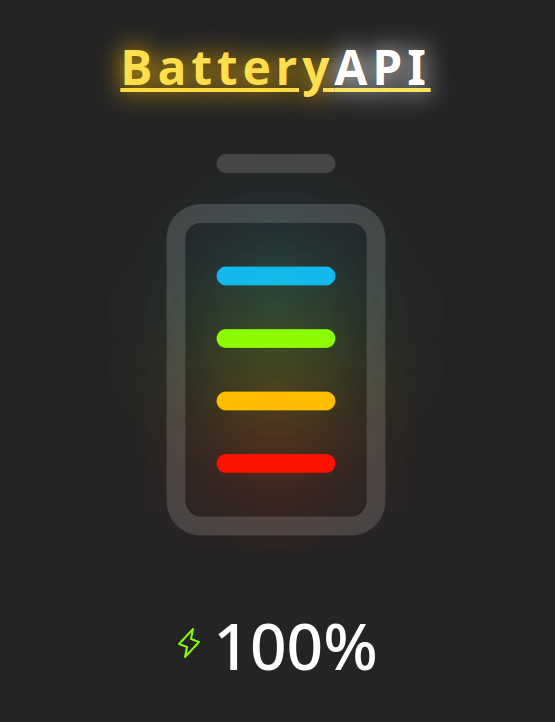

# Battery API

[View Application online](https://battery-test.netlify.app/)

This application was created to test the Battery API with a visual example of the features provided by browsers. The example allows you to see the current charge of the device, as well as to trigger an event when the device is charging, all in real time.

[MDN Battery API](https://developer.mozilla.org/en-US/docs/Web/API/Battery_Status_API)

## Run the APP

1. Download or clone the repository
2. Install dependencies `npm install`
3. Run the application `npm run dev`
